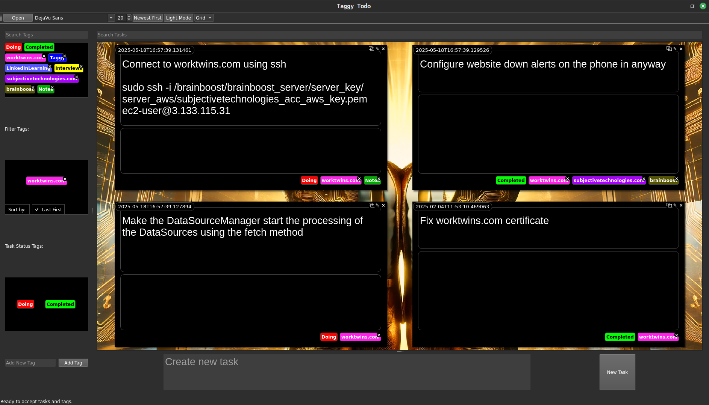

# Taggy Todo

A free, standalone task management application with a unique tag-centric interface.

## Philosophy: Everything is a Tag

Taggy Todo is built on a simple yet powerful concept: **everything is a tag**. 

Traditional task management apps use rigid structures like lists, boards, or complex hierarchies. Taggy Todo breaks free from these constraints by reimagining the entire user interface as a collection of dynamic, colorful tags.

Each tag represents not just a category, but a potential filter, status indicator, or visual organizer. The power is in the simplicity - tags can be dragged, filtered, colored, and even given background images to create a visual language that works for _your_ unique way of thinking.

## Key Features

- **100% Free and Local**: Your data stays on your computer in a local SQLite database
- **No Accounts Required**: No sign-ups, subscriptions, or cloud dependencies
- **Tag-Based Organization**: Create unlimited tags with custom colors
- **Visual Task Management**: Tasks appear as bubbles that can be tagged, filtered and organized
- **Rich Media Support**: Drag and drop images and PDFs directly into tasks
- **Customizable Interface**: Toggle between list and grid views, customize fonts, and choose light or dark mode
- **Drag-and-Drop Workflow**: Intuitive interface for applying tags and managing tasks
- **Powerful Filtering**: Instantly filter tasks by multiple tags

## Getting Started

1. Download the application (no installation required)
2. Run `python todo.py`
3. Start creating tasks and tags

## Why Taggy Todo?

- **Privacy First**: All data stays local - no tracking, no data collection
- **Flexible Organization**: Break free from rigid organizational systems
- **Visual Thinking**: Use colors and spatial organization that matches your mental model
- **Zero Learning Curve**: Intuitive interface that anyone can use immediately

## What Makes It Unique

Taggy Todo stands apart from typical task management apps. While most productivity tools use tags as a secondary feature, Taggy Todo makes tags the central organizing principle. You won't find many applications that:

- Allow tags to become the primary visual interface
- Let you create a personal visual language through colored, draggable tags
- Support attaching background images to tags to transform your workspace
- Combine rich media support with a tag-first approach
- Remain completely local and free from cloud dependencies

This unique approach creates a more organic, intuitive way to organize information that adapts to your thinking style rather than forcing you into predefined structures.

## Spread the Word

Taggy Todo is completely free, and you can help promote it through these channels:

- **Social Media**: Share screenshots of your setup on Twitter, Reddit, or productivity forums
- **Blog Posts**: Write about your experience and workflow with Taggy Todo
- **Open Source Communities**: Share with Python and PyQt communities
- **Productivity Subreddits**: r/productivity, r/PersonalProjects, r/opensource
- **Direct Sharing**: Show it to friends and colleagues who might benefit from a different approach to task management

## Contributing

Contributions are welcome! Feel free to fork the repository and submit pull requests.

## License

This project is licensed under the GNU General Public License v3.0 (GPL-3.0). This means:

- You are free to use, copy, distribute and modify the software
- If you distribute modified versions, you must make your source code available under the same license
- Changes you make must be documented and dated
- This full license can be found in the LICENSE file.

This license ensures the software remains free for everyone while encouraging contributions back to the project. 